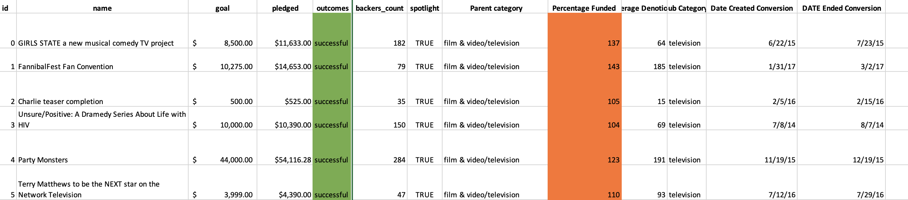
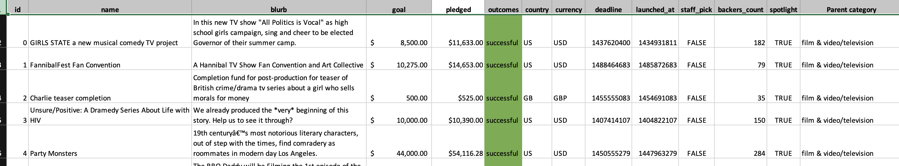
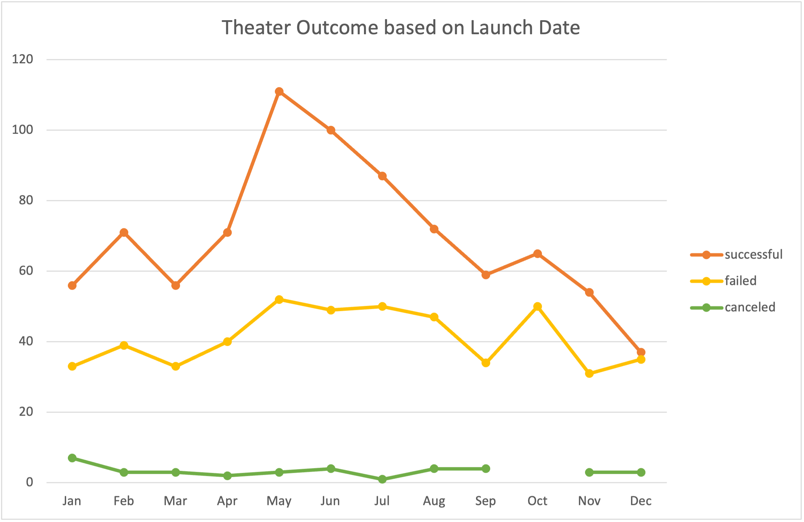
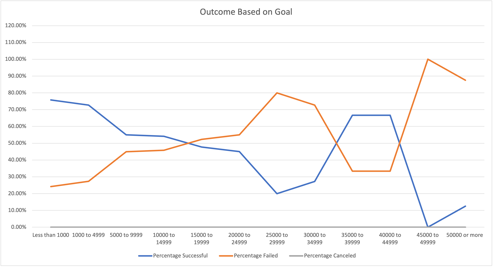

# Kickstarting with Excel

## Overview of Project

In this project we are helping an up and coming playwright louise, who wants to start a crowdfunding campaign to help fund "Fever" play. after analysing and taking outcomes from the data we will use these insights to help Louiose plan her campaign and set itup for success.

### Purpose

Louise is interested in creating a kickstarter campagin for her new play "Fever" and wants to analyze and make it a success. We will however explore some of the main criteria like launch date, goal amount , amount pledged and how will this impact her success for theatrical plays and present some initial conculusions.

## Analysis and Challenges

It contains over 4000 campaigns across the world with fundraising goal amount , amount pledged,  the outcome of the each campaign, the launch date with categories. 
To understand the data we need to filter and break it into more readble format , so we break the category to parent and sub categories. By using pivot table and charts we analyzed outcomes for each country 

### Analysis of Outcomes Based on Launch Date

we analyzed the relation between the success of a theatrical play campaign and the start date of the campaign.  the graphical results of the data in the chart below:

As we can explore that total number of 1369 campaigns were in US in a year. with 839 successful campigns, 493 failed and only 37 cancelled campaigns. The chart represent that from March the success rate increased exponentially with peak at  mid may , after that gradually there were decline in successful campagins. least successful was starting of december. Also cancellations do not seem to be correlated with the time of year of launch date.

### Analysis of Outcomes Based on Goals

In this we explored the relation between success of theatrical play campaign and fundraising goal. The following chart below shows the data for the reference.

We can analyze that lower fundraising amount have higher success rate i.e amount less than 1000 $ have 70% of sucesss campagins moving towards higher goal amount, the percentage of successful campaign is decling. we can see only 20% success rate for goal amount between $25000 to $29999.we see the success rate begins to invert between $15,000 and $20,000 goals with failure being more likely than success. We can also see another inversion from $35000 to $45000.

### Challenges and Difficulties Encountered

One of the challenge encountered was understanding pivot table & how to make the charts. 
Some campaigns had no backers which initially resulted in division by zero errors when considering average contributions; this was resolved with conditional statements.

	

## Results
 
 The final conclusion from the analysis we recommend that Louise launch her campaign in the spring time i.e April to may. Mostly avoid starting campaign at the end of year. 

 Reducing the goal amount will increase the chance of higher success rate. 

 Limitations 

 One of the main and clear limitation was data divided by the country , as US is a vast country more breakdown will ever provide the clear in depth data. 
 Other limitation is vintage of data , from the analysis it was clear that year 2016-17 has maximum  campaigns , and the data is from 2011 to 2017, so narrowing of data to 2016-17 may yield to different results or provide more data to solidify the analysis

### Other Area to explore

We can explore by duration of campaign , how this effect the success ratio. 
